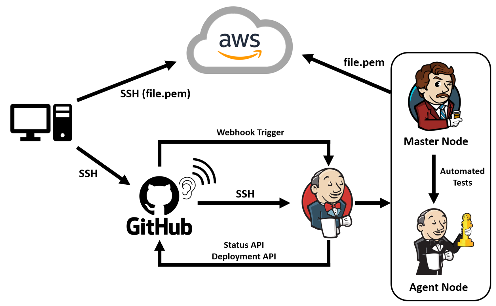

# CI/CD with Jenkins

CI/CD is a methodology to continually integrate, deliver and deploy applications to clients through the use of automation pipelines which aim to automate each phase of the SDLC.

## CI/CD/CDE

**Continuous Integration** (CI) aims to automate the **Build** and **Test** phases of the SDLC which helps developers continually merge work to a centralised repository which can then be automatically tested.

**Continuous Delivery** (CD) further automates the SDLC by automatically integrating and delivering the code to the **Staging** environment ready to be manually deployed to Production.

**Continuous Deployment** (CDE) takes it one step further and fully automates the SDLC by including the **Production** deployment into the automation pipeline.

## Benefits of CI/CD

- Faster time to market
- Reduced risk by capturing problems earlier
- Short review time through smaller increments
- Better code quality using automated testing
- Smoother path to production
- Faster and earlier bug fixes
- More efficient infrastructure
- Collaboration and communication

## Jenkins

Jenkins is an open-source automation server and CI/CD tool which aims to automate the different phases of the SDLC such as build, test and deployment by implementing CI/CD workflows called **Pipelines**.

Jenkins is written in the Java programming language, requiring the latest version of Java to run it and by default it listens on Port 8080.

The following list are alternative CI/CD tools to using Jenkins:

- Buddy
- TeamCity
- TravisCI
- CircleCI
- GitLab

## Jenkins Deployment Stages

The diagram below describes the different stages of Jenkins.

1. Firstly, an SSH connection must be established between GitHub and Jenkins so Jenkins can copy the updated code from GitHub automatically using a **Webhook Trigger**.

2. The code that Jenkins copies from GitHub then undergoes automated testing which is taken care of by the **Agent Node**. If the tests are successful, the **Master Node** that is orchestrating this process will continuously deliver that code to the staging area or immediately deploy it to Production, in this case on AWS, depending on the CI/CD configuration.

3. If any tests fail, the **Agent Node** sends back the code as a feedback loop back to the developers via GitHub so they can update the code for the next iteration.
