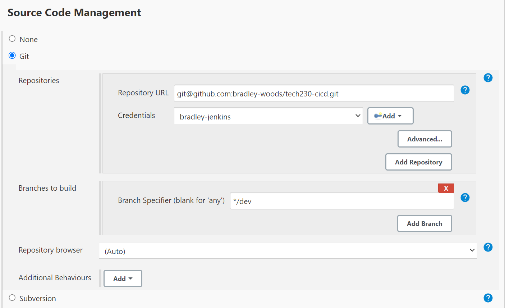
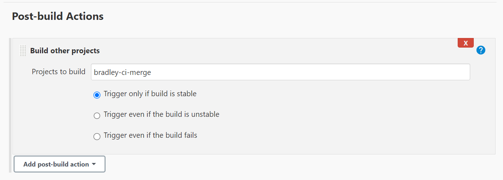

# Continuous Delivery using Jenkins

In this guide we will continue to automate the CI/CD pipeline by automating the merge process from the development branch to the `main` branch.

1. Firstly, make sure you have two branches on your repository such as `dev` and `main`. To create a new branch and checkout to it use the following command:

    ```bash
    $ git checkout -b <branch-name>
    ```

2. In Jenkins, create a job, for example 'bradley-ci' to fetch a GitHub repository using a Webhook and perform automated testing as shown in [here](https://github.com/bradley-woods/tech230-cicd/blob/main/webhook.md).

3. Ensure the job tracks the specified `dev` branch. This way it will clone everything on the `dev` branch in the GitHub repository.

    

4. Create a new job, for example 'bradley-ci-merge' which will be used to merge the development changes to the main branch if the first job's build was successful.

5. We will continue configuring this job in the same way as with previous jobs, specifying to track changes from the `dev` branch.

    However, we also need to add an 'Additional Behaviour' to 'Merge before build' using the `origin` repository to merge changes to the `main` branch, leaving it as the default merge strategy as shown below:

    

6. Next, we do not want a 'push' to GitHub to trigger this job, so we do not check the box this time in 'Build Triggers'.

7. Once this job is complete, we can test it works manually by clicking 'Build now'.

8. Once the merge job works manually, we can link it our first job to trigger on a successful build.

    Go back to the first job 'bradley-ci' and link it to the merge job 'bradley-ci-merge' by going to 'Post-build Actions' and choosing to 'Build other projects' selecting our merge job to trigger only if the first build is stable.

    

9. Now our changes should be automatically tested and if successful they will be merged to the main branch of our repository.
