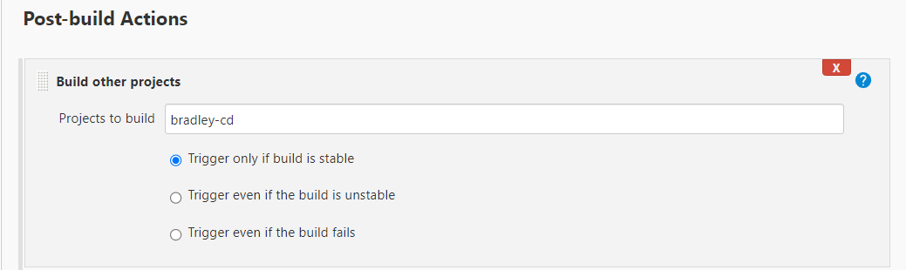

# CI/CD using Jenkins

In this guide we will continue to automate the CI/CD pipeline by automating the merge process from the development branch to the production branch and deploying the merged changes to an AWS EC2 instance.

## Continuous Integration and Delivery

1. Firstly, make sure you have two branches on your repository such as `dev` and `main`. To create a new branch and checkout to it use the following command:

    ```bash
    $ git checkout -b <branch-name>
    ```

2. In Jenkins, create a job, for example 'bradley-ci' to fetch a GitHub repository using a Webhook and perform automated testing as shown in [here](https://github.com/bradley-woods/tech230-cicd/blob/main/webhook.md).

3. Ensure the job tracks the specified `dev` branch. This way it will clone everything on the `dev` branch in the GitHub repository.

    

4. Create a new job, for example 'bradley-ci-merge' which will be used to merge the development changes to the main branch if the first job's build was successful.

5. We will continue configuring this job in the same way as with previous jobs, specifying to track changes from the `dev` branch.

    However, we also need to add an 'Additional Behaviour' to 'Merge before build' using the `origin` repository to merge changes to the `main` branch, leaving it as the default merge strategy as shown below:

    

6. Next, we do not want a 'push' to GitHub to trigger this job, so we do not check the box this time in 'Build Triggers'.

7. Go to 'Post-build Actions' and select 'Git Publisher' and then check the box to 'Push Only If Build Succeeds' and to 'Merge Results'. This ensures the merged changes are pushed back to the GitHub repository.

    

8. We can now save the job and test it works manually by clicking 'Build now'.

9. Once the merge job works manually, we can link it our first job to trigger on a successful build.

    Go back to the first job 'bradley-ci' and link it to the merge job 'bradley-ci-merge' by going to 'Post-build Actions' and choosing to 'Build other projects' selecting our merge job to trigger only if the first build is stable.

    

10. Now our changes should be automatically tested and if successful they will be merged to the main branch of our repository.

## Continuous Deployment

1. Firstly, we will create a new job called 'bradley-cd' which will be used to release our new app folder (new feature) from GitHub `main` branch to the production instance which will be running in front of clients.

2. Next, under 'Source Code Management' we will want to specify our `main` branch to download from since this will now be up to date with the development changes.

    

3. Next, under 'Build Environment' we want to 'Provide Node & npm bin/ folder to PATH' and check the box for 'SSH Agent', selecting our tech230.pem SSH key which allows Jenkins access to the AWS EC2 instance via SSH.

    

4. Now, we can add a build step to 'Execute shell' as shown below. This will copy the app folder from the Jenkins workspace, which is from the merged main branch on GitHub, into the AWS EC2 instance, specifying the IP address of the EC2 instance to connect to. Then using the ssh command, we can remotely run commands to install and run the updated application.

    ```bash
    rsync -avz -e "ssh -o StrictHostKeyChecking=no" app ubuntu@ec2-54-170-23-204.eu-west-1.compute.amazonaws.com:/home/ubuntu
    ssh -o "StrictHostKeyChecking=no" ubuntu@ec2-54-170-23-204.eu-west-1.compute.amazonaws.com <<EOF
        sudo bash ./app/provsion.sh
        cd /home/ubuntu/app
        npm install
        pm2 kill
        pm2 start app.js
    EOF
    ```

    

5. Finally, we can save the job and manually build it, if it succeeds, we can add it to the pipeline by editing our configuration for the 'bradley-ci-merge' job adding a 'Post-build Action' to start the 'bradley-cd' job, in the same way we did previously.

    

## Checking the CI/CD Pipeline

1. Now, if we make a change in the application code, for example, editing a heading in 'index.ejs' to change '*The app is running correctly.*' to '*The app is running correctly and deployed using Jenkins!*' and push the change to the `dev` branch on the GitHub repository, our Jenkins pipeline should automatically start the build process and if all is successful and the automated tests pass, the new app should be running as shown below:

    
