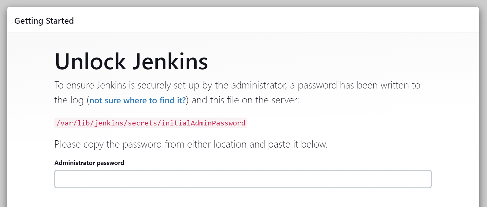
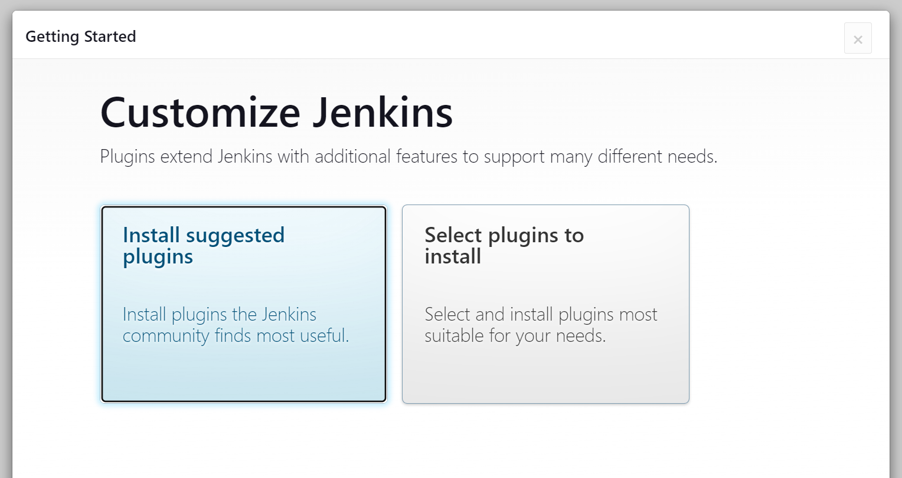
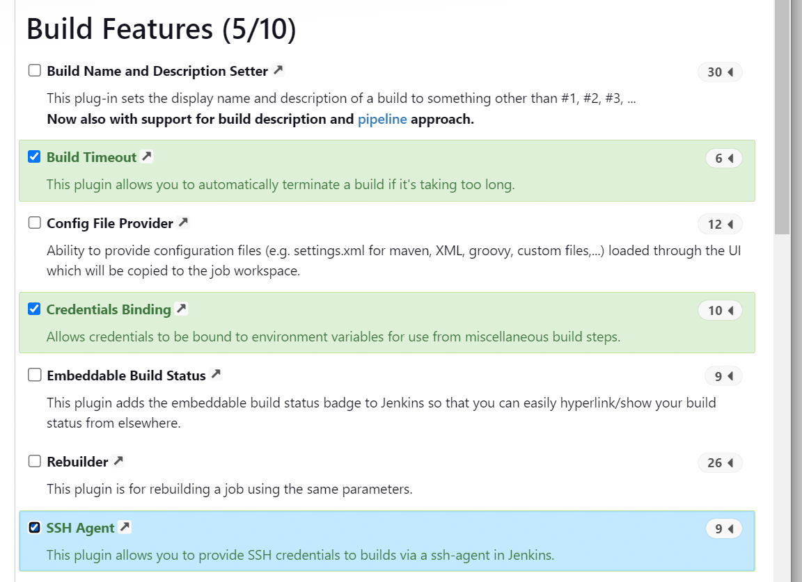
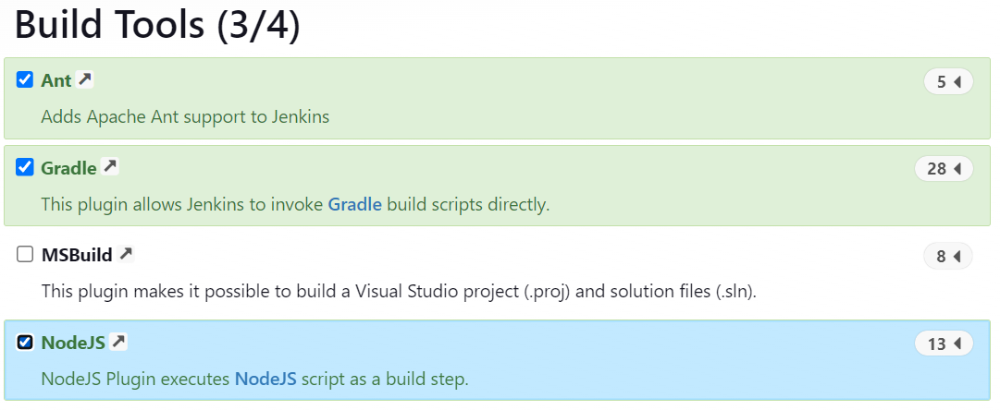
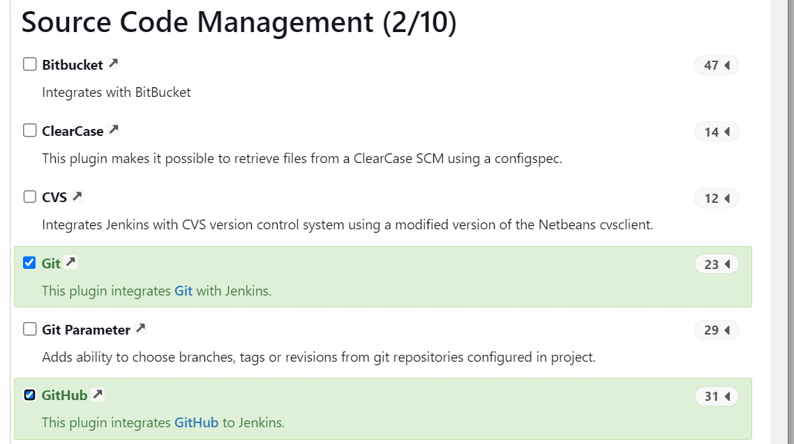
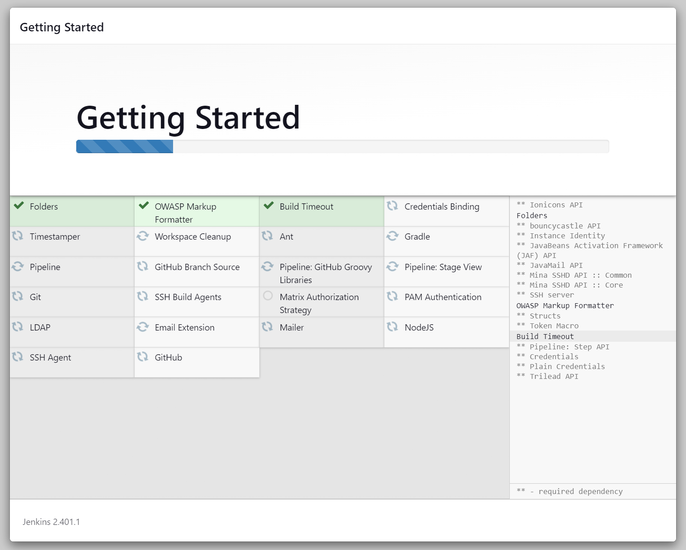
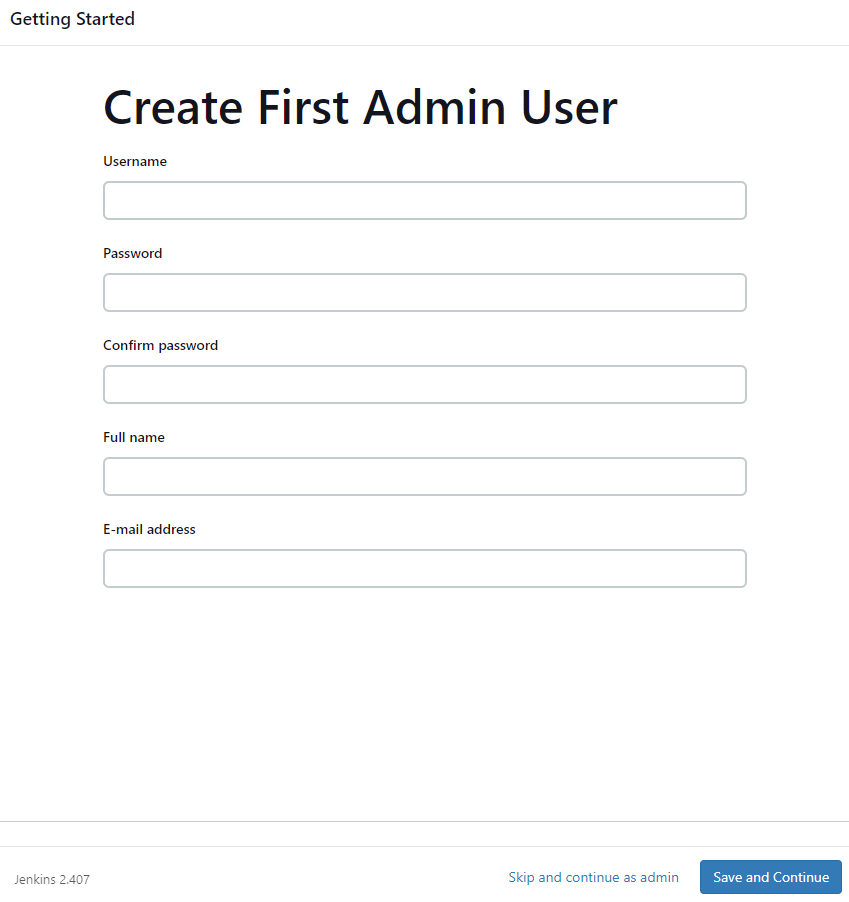
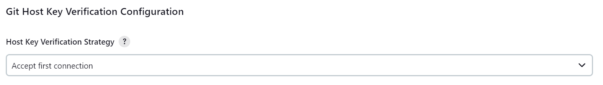

# Creating a Jenkins Server

In this guide, we will create our own Jenkins server hosted on an Ubuntu 18.04 AWS EC2 instance. This can then be used to set up a CI/CD pipeline as outlined [here](https://github.com/bradley-woods/tech230-cicd/blob/main/jenkins-cicd.md).

1. Firstly, create an EC2 instance on AWS that will host our Jenkins server: [aws-ec2-setup](https://github.com/bradley-woods/tech230-aws/blob/main/aws-ec2-setup.md). Make sure the security group rules allow SSH, HTTP and port 8080 to communicate with Jenkins.

2. Next, we can SSH into the instance and run the following commands as outlined [here](https://pkg.jenkins.io/debian-stable/) to install Jenkins and the required dependencies needed such as Java etc.

    ```bash
    # Update and upgrade package source list
    sudo apt update -y && sudo apt upgrade -y

    # Add key to access Jenkins Debian package repository
    curl -fsSL https://pkg.jenkins.io/debian-stable/jenkins.io-2023.key | sudo tee \
    /usr/share/keyrings/jenkins-keyring.asc > /dev/null

    # Add the Jenkins apt repository to source list
     echo deb [signed-by=/usr/share/keyrings/jenkins-keyring.asc] \
    https://pkg.jenkins.io/debian-stable binary/ | sudo tee \
    /etc/apt/sources.list.d/jenkins.list > /dev/null

    # Update package source list
    sudo apt update

    # Install Java 11 Runtime Environment
    sudo apt install fontconfig openjdk-11-jre -y

    # Install and start Jenkins
    sudo apt install jenkins

    # Enable jenkins to start at boot
    sudo systemctl enable jenkins
    ```

3. Now we have our Jenkins server up and running, we can unlock and sign into the Jenkins UI by navigating to the server's public IP address on port 8080. The following page shall appear where we can unlock Jenkins by entering the 'Administrator password' which is presented in the terminal log when installing Jenkins for the first time or by checking the `/var/lib/jenkins/secrets/initialAdminPassword` file.

    

4. The next step is to install the necessary plugins to create our CI/CD pipeline, so click on 'Select plugins to install' as follows:

    

5. In addition to the pre-selected suggested plugins we need to also select and install the following plugins to create our particular pipeline:

   - Build Features > SSH Agent

   - Build Tools > NodeJS

   - Source Code Management > Git and GitHub

    

    

      

6. Next, wait for Jenkins to finish installing the plugins, checking that the necessary plugins are being installed.

    

    > **Note:** if you need to install additional plugins later, you can do this from the 'Manage Jenkins > System Configuration > Plugins' menu once Jenkins is fully configured and you have signed in as an Admin user.

7. The final step is to create an Admin User to sign in to the Jenkins console, or you can continue as a default 'admin' user, using the password provided previously.

    

8. The Jenkins Server should be successfully set up. We can now make our CI/CD pipeline as outlined [here](https://github.com/bradley-woods/tech230-cicd/blob/main/jenkins-cicd.md). For the SSH connection between GitHub and Jenkins to be successful the first time, go to 'Manage Jenkins > Security' and scroll to the bottom and change this setting from 'Known hosts file' to 'Accept first connection' to automatically add the host keys to the 'known_hosts' file on first connection with the repository.

    
