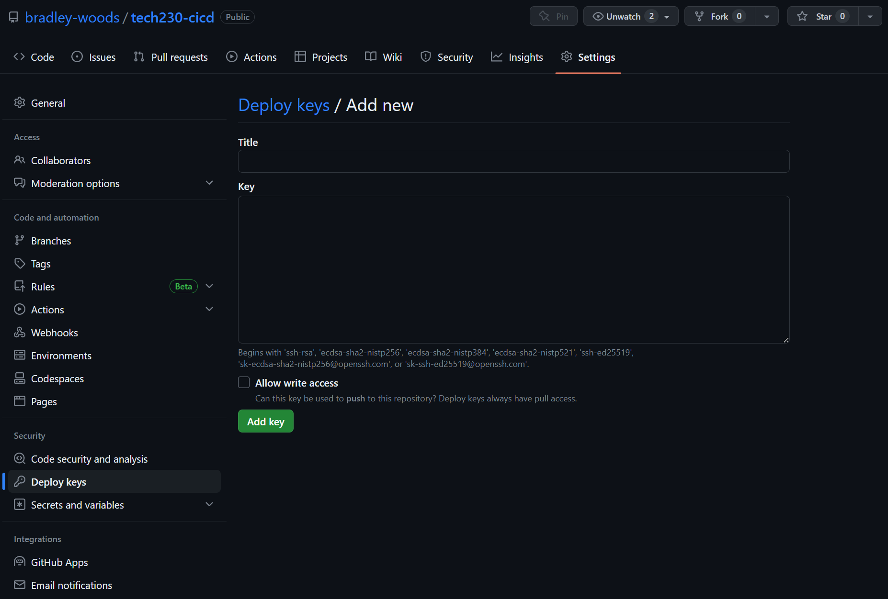
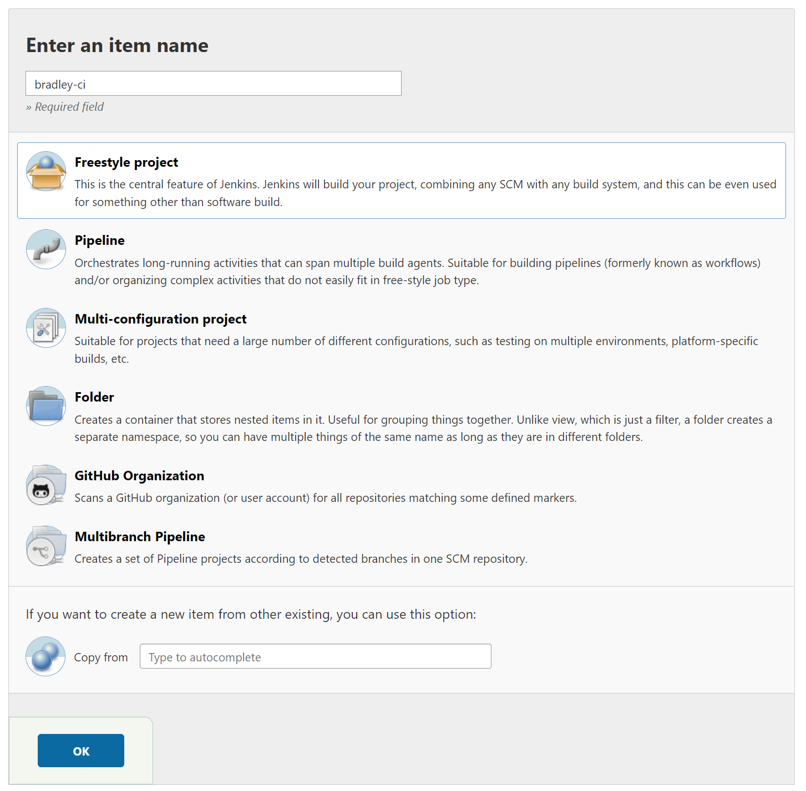
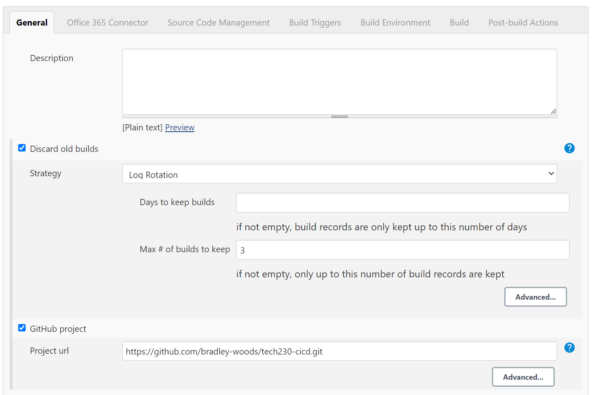
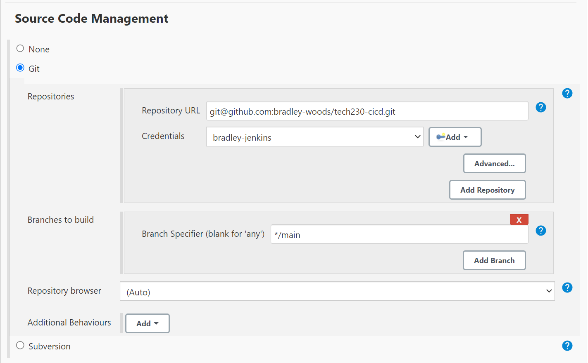
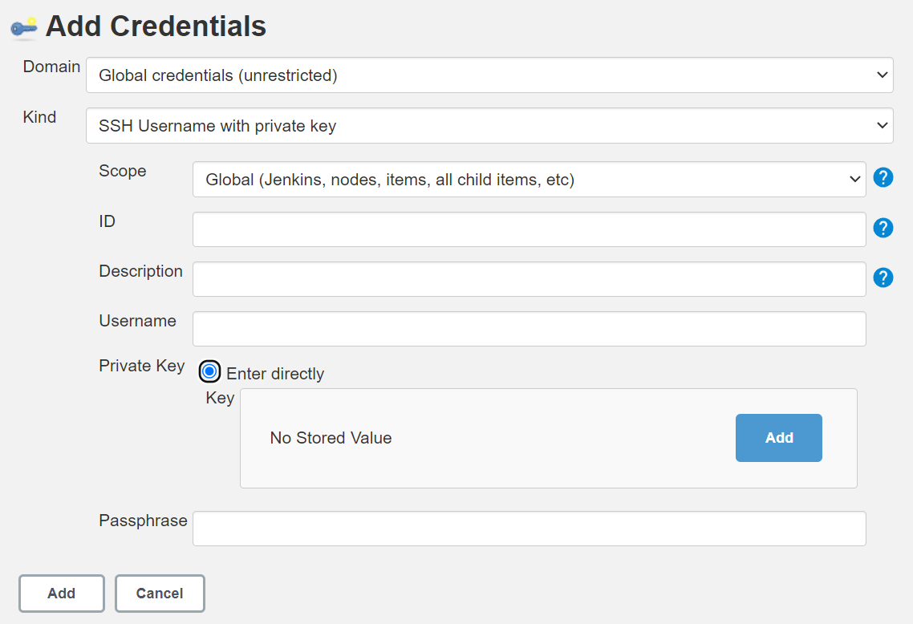

# Connecting GitHub and Jenkins using SSH

1. The first step is to create a local SSH key pair in our '.ssh' folder as outlined in the first three steps [here](https://github.com/bradley-woods/tech230-github-ssh).

2. Next, log in to your GitHub and instead of adding the public key to the general settings, we need to add it to an individual repo by navigating to the repository and going to 'Security' > 'Deploy keys' and pasting in the public key here.

    

3. Now we can log in to Jenkins and create a new 'Freestyle project' job as follows:

    

4. On the next page, select 'GitHub project' and copy our repo HTTPS URL from GitHub and paste it into the 'Project url' as shown:

    

5. Scroll down and select 'Git' as the 'Source Code Management' and copy the SSH link of your GitHub repository. We can then add a new SSH key by clicking the 'add' button.

    

6. We can then select 'SSH Username with private key' and enter an ID for the kay and the Private key itself by pasting in our private key, clicking 'Add' when finished.

    

7. The GitHub repository and Jenkins should now be connected using SSH keys.
