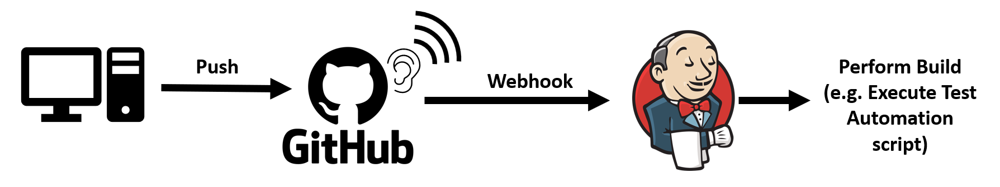
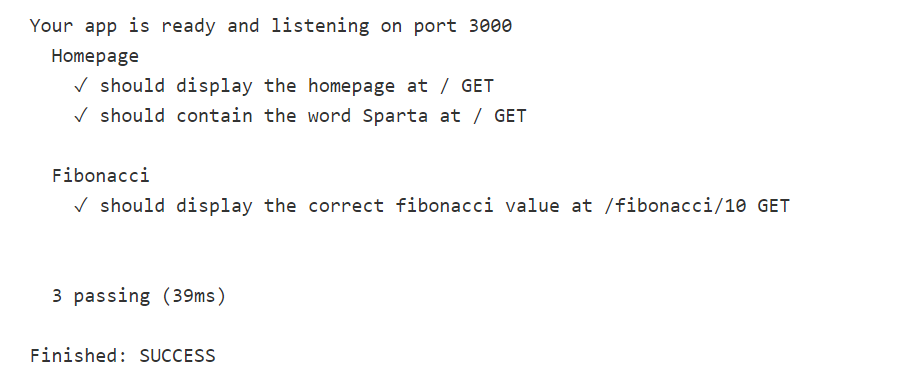

# Webhooks

Webhooks are automated messages sent from apps when something happens. They have a message or payload and are sent to a unique URL (the app's phone number or address). E.g. an automated email you receive when ordering an item.

## GitHub Webhook Setup for Jenkins

1. The first step is to create the webhook on the GitHub repository by going to the repo 'Settings' > 'Webhooks' and clicking 'Add webhook'. We then need to enter the 'Payload URL' which is the IP of the Jenkins server with 'github-webhooks' added to the end.

    

    Also, we can select which events to trigger the webhook, in this case we just want to trigger every time we 'push' to GitHub.

2. Once added, the list of Webhooks for this repo are listed below:

    

3. The next step is to create a new job in Jenkins with an SSH connection to GitHub already set up as explained [here](https://github.com/bradley-woods/tech230-cicd/blob/main/jenkins-ssh.md).

4. Next, in the Configuration settings of the job, go to 'Office 365 Connector' and tick the box for 'Restrict where this project can be run' and enter the name of the Master Node. Since, this node is serviced by an AWS Cloud Auto Scaling Group, if it needs additional servers (EC2 instances) it will automatically create them for the purpose of this job.  

    

5. Then go to 'Build Triggers' and tick the box for 'GitHub hook trigger for GITScm polling'.

    

    This allows Jenkins to listen to GitHub for any 'push' commands using the newly created webhook. So, when there is a change made to the repository defined in the SCM Git section, the Jenkins build will run.

## Automated Testing

1. Finally, in the build section we can enter our commands to perform automated tests on build, which will be triggered every time the GitHub repo is updated, meaning we have successfully set up automated testing.

    

2. If we click 'Polling Log' on the left side, we can see the build log and what caused the build to be triggered, in this case it was the 'push' event to the GitHub webhook.

    

3. Finally, we can also look at the 'Console Output' and see that the automated testing was successful:

    
    
